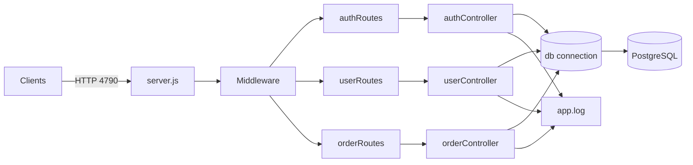
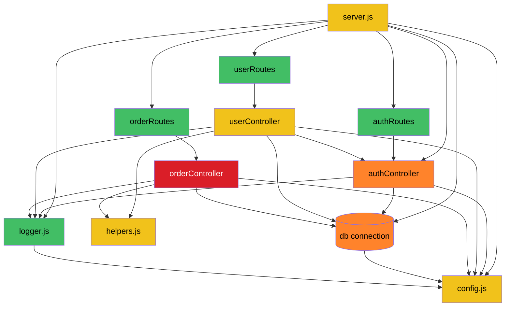
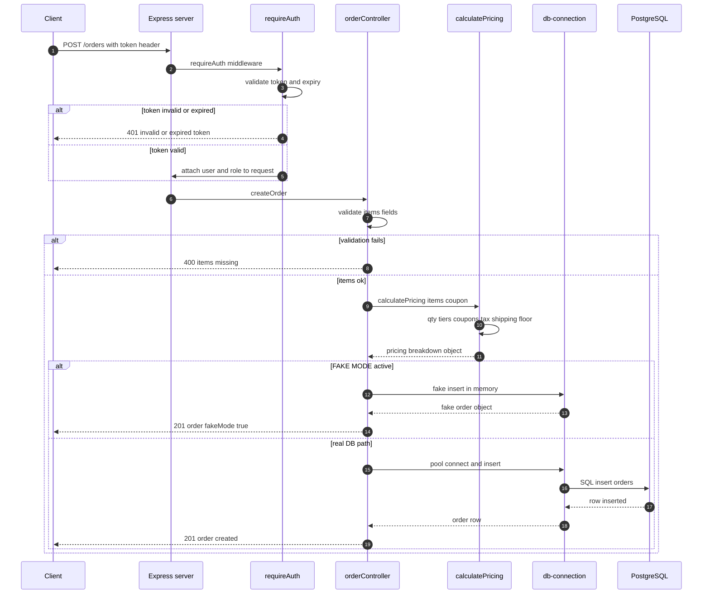
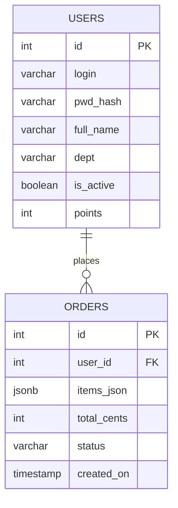
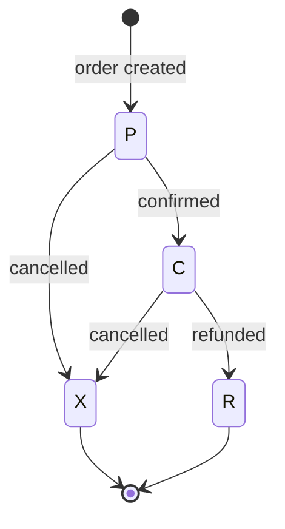

# OMS API — Architecture Reference

> Auto-generated by Bob X-Ray — Legacy Knowledge Rescue. Mermaid-safe edition (v10.9.x).
> Every diagram is reverse-engineered from code — not from docs (the docs are lying anyway).

---

## 1. System Map

**Flow in one line:** Client → server.js (Express, port 4790) → routes (wiring) → controllers (all business logic) → db/connection.js → PostgreSQL.
When the DB is down, the **FAKE_MODE** fallback in db/connection.js activates — endpoints keep working with in-memory stubs.

---

## 2. Module Dependency Graph (node color = risk score, from RISK-REPORT.md)

**Patterns the scan caught:**
- `orderController` (300+ lines) is the heaviest file — pricing engine + lifecycle, risk 8/10
- Every controller depends on `config.js` — changing config means testing the whole repo (and there are no tests)
- `userController` → `authController` dependency (shared password/token helpers)
- `logger.js` format is frozen — ops grep scripts depend on it

---

## 3. Order-Create Sequence — POST /orders

---

## 4. Entity-Relationship Diagram (inferred from queries)

- `users.pwd_hash` = base64-encoded (legacy, upgrade pending)
- `users.is_active` = soft-delete flag — **hard delete never happens** (finance dashboards join on users)
- `orders.items_json` = JSON blob of line items (inherited from v1 design in legacy/old_schema.sql)
- `orders.total_cents` = **all money in cents, floorCents round-DOWN** (finance spec v1.2 — the 2019 audit found a $0.01 discrepancy, which is why Math.round is banned)

---

## 5. Order Status Machine

- `P` pending · `C` confirmed · `X` cancelled · `R` refunded
- API_DOCS_v2019.md only knows P/C/X — **it never mentioned R** (lie table entry #7)
- Cancel/refund rules are enforced in `orderController`, not at the DB level

---

## 6. Tech Stack

| Layer | Choice | Note |
|-------|--------|------|
| Runtime | Node.js | no engine pin |
| Framework | Express | port 4790 hardcoded |
| DB | PostgreSQL | pool + FAKE_MODE fallback |
| Auth | Token header + in-memory sessions | TTL 72h (TOKEN_TTL_HOURS) |
| Pricing | orderController inline engine | tiers 10/25/50 → 5/10/15% |
| Coupons | LAUNCH50 50% · GHOST20 20% | GHOST20 "expired" but active — do not touch |
| Testing | None | manual curl is the only verification |

---

## 7. Tribal Knowledge (the stuff nobody documents)

1. **Never change port 4790** — the finance reconciliation job depends on it; the fallback must stay 4790 too
2. **Use floorCents, never Math.round** — the 2019 audit found a $0.01 discrepancy
3. **GHOST20 is officially dead, practically alive** — removing it will trigger a sales escalation
4. **FAKE_MODE is detectable** — it logs a warning; great for local dev, a red flag in prod
5. **API_DOCS_v2019.md is lying** — 8 confirmed conflicts with code (Basic Auth, TTL 24h, no coupons, no refund, hard delete, /v1/ prefix, no R status, no /health). This kit replaces it.