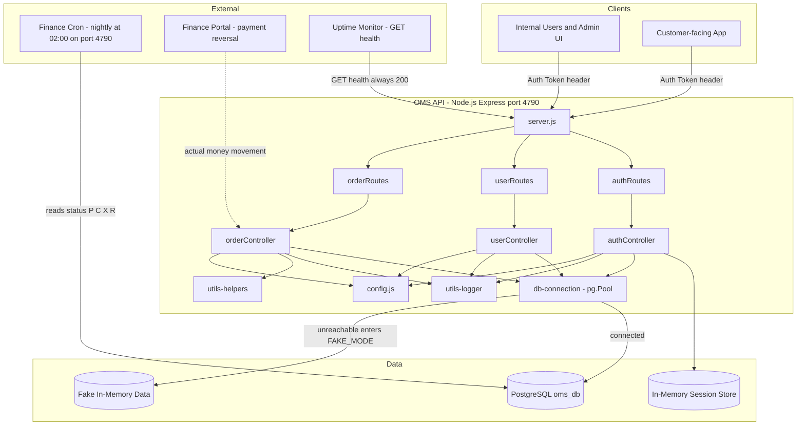
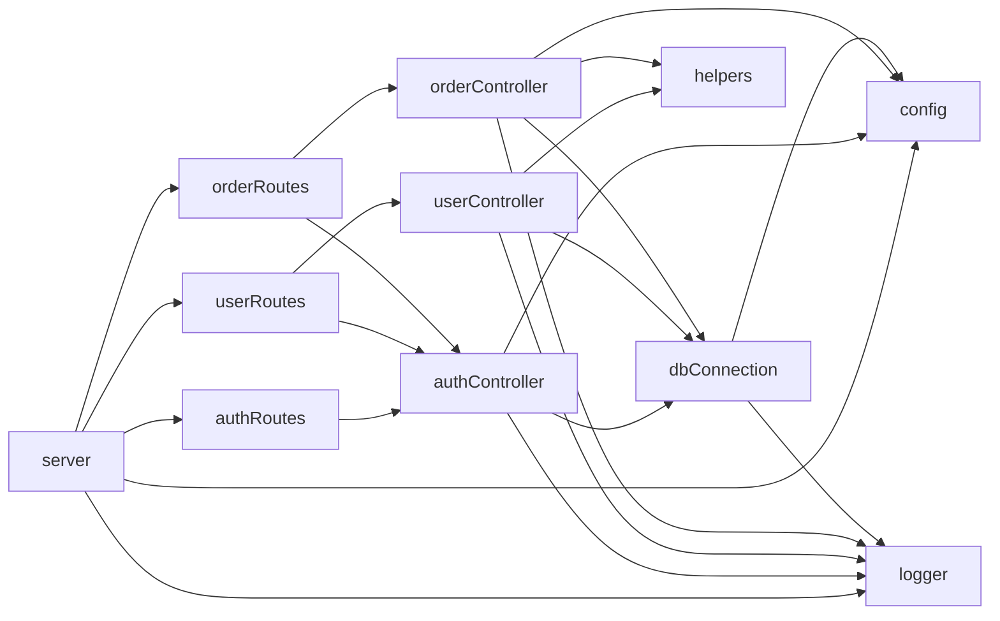
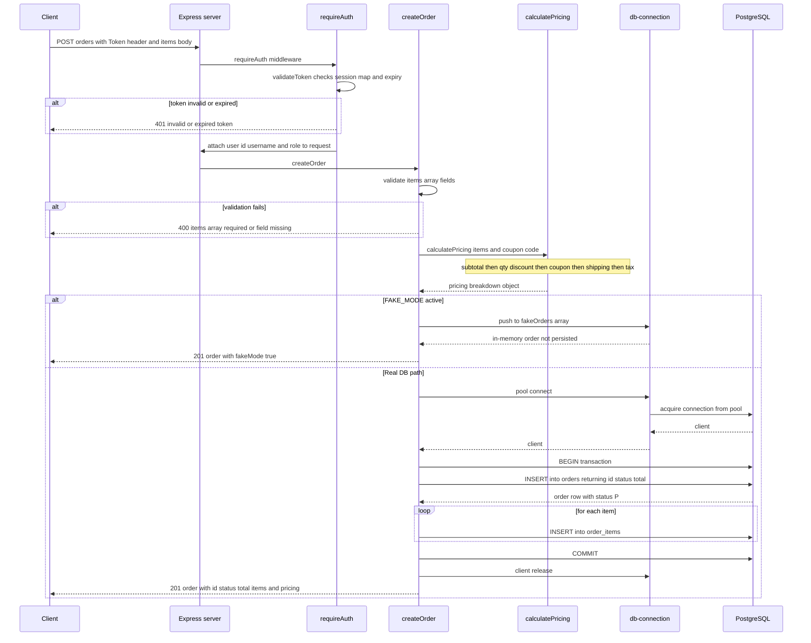
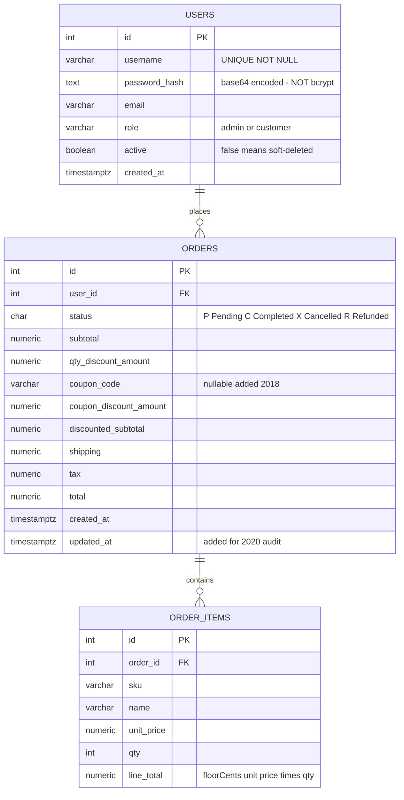

# OMS API — Architecture Reference

> All diagrams reflect the **actual running code**, not the outdated `docs/API_DOCS_v2019.md`.

---

## 1. System Map

High-level view of the OMS API and its external touchpoints.

---

## 2. Module Dependency Graph

How source files depend on each other inside the project.

> **Note:** `authController.js` is imported by both `authRoutes.js` and the other two route files (to access the `requireAuth` middleware). It is a shared cross-cutting dependency.

---

## 3. Order-Create Sequence Diagram

What happens when a client calls `POST /orders`.

---

## 4. Entity-Relationship Diagram

Database schema as inferred from the active queries in the codebase (not from `old_schema.sql`).

> **Schema history:** v1 (2017) stored line items as `items_json TEXT` on the `orders` table with no `order_items` table. The `coupon_code` column was added in 2018. `users.active` was added after the "ghost account" incident of 2019. `orders.updated_at` was added for the 2020 audit. Migration files `migration_001.sql` and `migration_002.sql` are referenced in comments but are no longer present in the repo.
